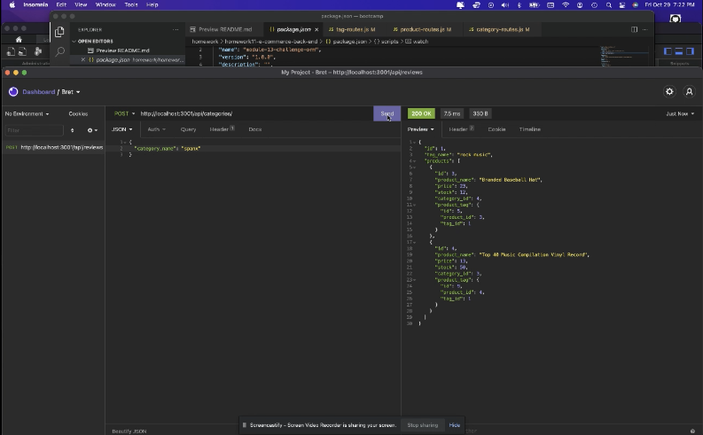

# e-commerce-back-end

Homework#11 - Ecommerce back end

## what did I do?

This assignment included making a functional backend API for an internet retailer. This application had starter code that needed to be finished in order to get functionality up and running. Express.js, Sequelize, and MySQL were set up so that API GET, POST, PUT, and DELETE routes work correctly in Insomnia.

## what do I need to explain

N/A

## video walk through

